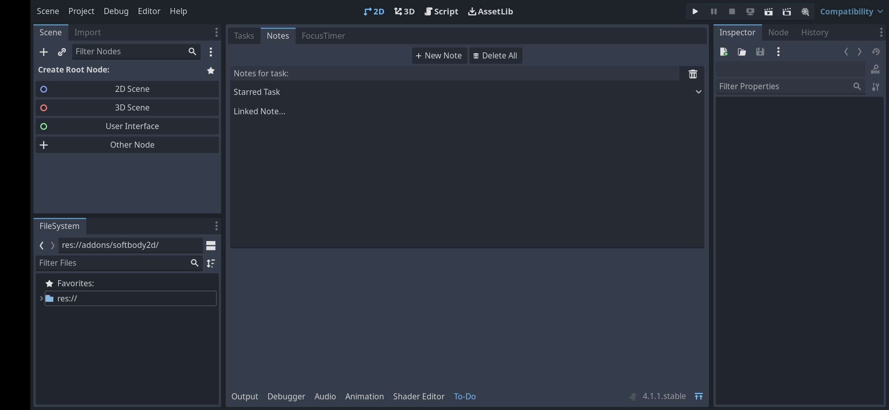

# GD To-Do Is A Powerful Add-on For Managing Tasks Inside Godot Engine
This repository is for Godot 4.x [click here](https://github.com/attilaoroszdev/GD_To-Do_3x) for Godot.3 version.
---
## Features
### Notes
Write down your thoughts anytime using notes.

### Focus Timer
Set a timer or focus freely on your task.

### Focus History
Keep track of your focus time.

### To-do list
Create an unlimited list of tasks.

### Starred Tasks
You can mark your tasks as starred so they would be prioritized.

### Task Links
Link your task to a note or start focus.

### Tasks Ordering
Order your tasks as you want.

---
## Installation
Copy "addons" folder directly to your Godot project folder.
Go to "ProjectSettings/Plugins" and enable "GD To-Do"
This will add a new tab in the bottom panel means installation was successful.